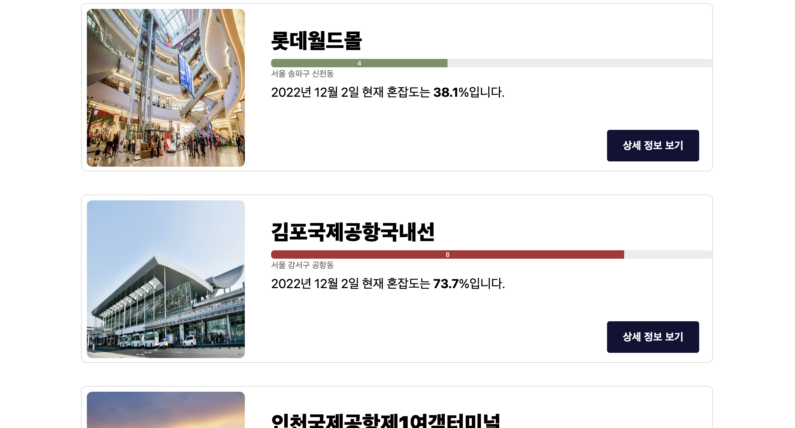

# Trip Checker

<p align="center"></p>
Real-time Congestion Checker for Popular Places


## Introduction

SKKU Trip Checker is a web-application that check congestion for some places provied by [SK Open API: 장소(POI) 통합 검색](https://skopenapi.readme.io/reference/%EC%9E%A5%EC%86%8C%ED%86%B5%ED%95%A9%EA%B2%80%EC%83%89) .  [SK Open API: 장소(POI) 통합 검색](https://skopenapi.readme.io/reference/%EC%9E%A5%EC%86%8C%ED%86%B5%ED%95%A9%EA%B2%80%EC%83%89) API has been used for this project.

Most of us have been inconvenienced by high dense of people. You feel more uncomfortable when go on trip.
To prevent this, here the Trip Checker comes!

SKKU Trip Checker can check REAL-TIME congestion for trip places(e.g. shopping places, tourist attractions and leisure sports spots). When go on trip, you can check congestion of the place.
Also, SKKU Trip Checker provides future congestion prediction by statistical data. You can plan your comportable trip by this app.

## Quick start

Please open the `src/index.html`

## Required

Please make your own `secret.js` in `src/js`
```javascript
// secret.js
const API_KEY = "[YOUR API KEY]";
const PROXY_URL = "[YOUR PROXY SERVER URL]";

```
API_KEY can be obtained at [SK Open API](https://openapi.sk.com/mypage/project/).

We used [Heroku](https://www.heroku.com) proxy server.

##  How to use



When SKKU Trip Checker opens, main page has search box and list of some popular default places.

List of places provide information such as name of place, address, and congetion level with bar.


Places can be searched by address and name.


You can search by date to see future and past congestion level.


You can see more information by click the button.


Detail page provides real-time, yesterday,monthly congestion with bar.
You can return to main page by click Home button

## Example

This is example of using app.

Result


## Contributor
OSS Team 4, Fall 2022, SKKU

## License
This repository follows the [MIT License](LICENSE)

## Youtube link

우수 프로젝트 시상 프로그램에 지원합니다.